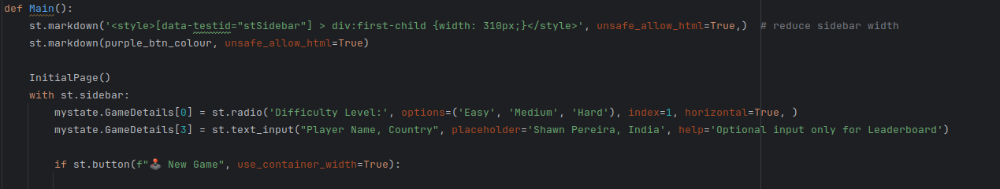
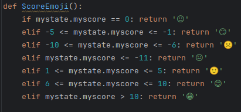

# Requistos vs código
## Requisitos Funcionales y Criterios de Aceptación

| Requisito y Criterios de Aceptación                                                                                                                                                                                                                                                                                                                                                                                                                                                                                                                                      | Código/Imagen                                            |
|--------------------------------------------------------------------------------------------------------------------------------------------------------------------------------------------------------------------------------------------------------------------------------------------------------------------------------------------------------------------------------------------------------------------------------------------------------------------------------------------------------------------------------------------------------------------------|----------------------------------------------------------|
| **1. Configuración de Nivel de Dificultad** **Requisito:** El sistema debe permitir a los jugadores seleccionar el nivel de dificultad antes de comenzar el juego. **Criterios de Aceptación:** - Opciones de dificultad fácil, medio y difícil disponibles para selección. - La configuración de dificultad debe influir en la mecánica del juego, como la frecuencia de regeneración de imágenes y la puntuación. - Tiempos de regeneración específicos:   - Fácil: cada 8 segundos.   - Medio: cada 6 segundos.   - Difícil: cada 5 segundos. |                                   |
| **2. Inicialización del Tablero** **Requisito:** Al comenzar un juego, el sistema debe inicializar el tablero con un conjunto aleatorio de imágenes basado en la dificultad seleccionada. **Criterios de Aceptación:** - El tablero debe ser llenado con imágenes de emojis que corresponden a la dificultad elegida. - Ninguna imagen objetivo (emoji de la barra lateral) debe aparecer más de una vez en el tablero inicial. - La imagen objetivo debe ser seleccionada aleatoriamente y mostrada en la barra lateral.                                 |    |
| **3. Parametrización del Nombre del Jugador y País** **Requisito:** El sistema debe permitir a los jugadores ingresar su nombre y país antes de comenzar el juego. **Criterios de Aceptación:** - Debe existir un campo de texto para que los jugadores ingresen su nombre y país. - Es posible que los campos de nombre y país estén vacíos, pero en ese caso no se muestra el _Leaderboard_ - La información del jugador debe persistir durante la sesión de juego.                                                                                     |                                       |
| **4. Emoji seg煤n el puntaje** **Criterios de aceptación** - si el puntaje es 0 muestra  - Si el puntaje esta entre -5 y -1 muestra  - Si el puntaje esta entre -10 y -6 muestra 癸 - Si el puntaje es menor o igual a -11 muestra  - Si el puntaje esta entre 1 y 5 muestra  - Si el puntaje esta entre 6 y 10 muestra   si el puntaje es mayor que 10 muestra                                                                                                                                                                    |                                                    |